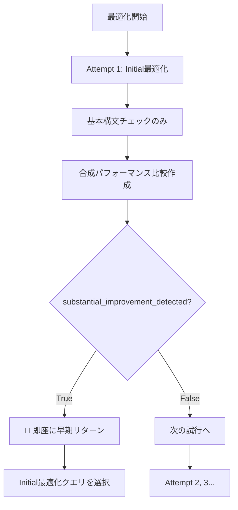
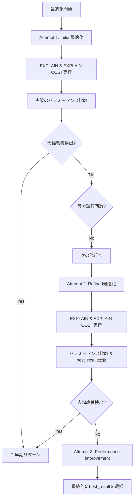

# 🔍 EXPLAIN_ENABLED 設定による挙動の違いの詳細分析

## 📋 概要

`EXPLAIN_ENABLED` 設定により、SQL最適化システムの挙動が大きく異なります。特にクエリ選択ロジックにおいて重要な違いがあります。

## 🔧 EXPLAIN_ENABLED = 'N' の場合の挙動

### 基本動作フロー



### 詳細な実装

**1. EXPLAIN実行のスキップ:**
```python
# query_profiler_analysis.py:15466
print(f"⚠️ EXPLAIN_ENABLED = 'N': Skipping EXPLAIN execution for attempt {attempt_num}")
print(f"💡 Using basic SQL syntax validation instead")
```

**2. 基本構文チェック:**
```python
# 基本的なSQL構文チェック
if not current_query or not current_query.strip():
    # エラー処理
if not re.search(r'\bSELECT\b', current_query, re.IGNORECASE):
    # エラー処理
```

**3. 合成パフォーマンス比較の作成:**
```python
# query_profiler_analysis.py:15804-15817
performance_comparison = {
    'is_optimization_beneficial': True,
    'performance_degradation_detected': False,
    'significant_improvement_detected': True,
    'substantial_improvement_detected': True,  # ← 常にTrue
    'minor_improvement_detected': True,
    'recommendation': 'use_optimized',
    'total_cost_ratio': 0.8,  # 仮の20%改善
    'memory_usage_ratio': 0.8,
    'evaluation_type': 'explain_disabled_bottleneck_analysis'
}
```

**4. 早期リターンの実行:**
```python
# 修正後のロジック（15960-15995行付近）
if performance_comparison and performance_comparison.get('substantial_improvement_detected', False):
    print(f"🚀 Attempt {attempt_num}: Substantial improvement achieved!")
    # optimization_attempts に追加
    return {
        'final_status': 'optimization_success',
        'final_query': current_query,  # ← Initial最適化クエリ
        'successful_attempt': attempt_num,  # ← 通常は1
        'achievement_type': 'substantial_improvement'
    }
```

### 結果的な挙動

- **✅ 期待通り:** Initial最適化クエリ（Attempt 1）が選択される
- **⚡ 高速:** 1回目の試行で即座に終了
- **🎯 根拠:** ボトルネック分析に基づく最適化を信頼
- **⚠️ 制限:** 実際のパフォーマンス検証なし

## 🔧 EXPLAIN_ENABLED = 'Y' の場合の挙動

### 基本動作フロー



### 詳細な実装

**1. EXPLAIN実行:**
```python
# query_profiler_analysis.py:15439-15450
explain_result = execute_explain_with_retry_logic(
    current_query, 
    analysis_result, 
    metrics, 
    max_retries=MAX_RETRIES, 
    current_attempt_num=attempt_num
)
```

**2. 実際のパフォーマンス比較:**
```python
# query_profiler_analysis.py:15793-15794
print(f"🔍 Executing compare_query_performance...")
performance_comparison = compare_query_performance(original_cost_content, optimized_cost_content)
```

**3. best_result更新ロジック:**
```python
# query_profiler_analysis.py:15840-15865
is_better_than_best = (
    current_cost_ratio < (best_result['cost_ratio'] - cost_improvement_threshold) or 
    (abs(current_cost_ratio - best_result['cost_ratio']) <= cost_improvement_threshold and 
     current_memory_ratio < best_result['memory_ratio'])
)

if is_better_than_best:
    print(f"🏆 Attempt {attempt_num}: New best result recorded!")
    best_result.update({
        'attempt_num': attempt_num,
        'query': current_query,
        'cost_ratio': current_cost_ratio,
        'memory_ratio': current_memory_ratio,
        'performance_comparison': performance_comparison,
        'optimized_result': optimized_query_str,
        'status': 'improved'
    })
```

**4. 最終選択ロジック:**
```python
# query_profiler_analysis.py:16112-16140
if best_result['attempt_num'] > 0:
    print(f"🥇 FINAL SELECTION: Attempt {best_result['attempt_num']} has been chosen as the optimized query")
    final_query = best_result['query']  # ← 最も性能の良いクエリ
else:
    print(f"⚠️ Using original query due to errors or evaluation failures in all attempts")
    final_query = original_query  # ← 元クエリ
```

### 結果的な挙動

- **🎯 精密:** 実際のEXPLAIN COSTに基づく比較
- **🏆 最適:** 複数試行の中で最も性能の良いクエリを選択
- **📊 根拠:** 具体的なコスト比率とメモリ使用量
- **⏱️ 時間:** 複数回のEXPLAIN実行で時間がかかる

## 🔍 重要な問題の発見

### ❌ 現在の実装の問題点

**EXPLAIN_ENABLED = 'N' の場合:**

1. **Initial最適化クエリの強制選択:**
   - `substantial_improvement_detected = True` が常に設定される
   - Attempt 1で必ず早期リターンが発生
   - Attempt 2, 3は実行されない

2. **複数試行の無効化:**
   - 設計上は3回の試行を想定
   - 実際はAttempt 1のみで終了
   - より良い最適化の機会を逃している

**EXPLAIN_ENABLED = 'Y' の場合:**

1. **期待通りの動作:**
   - 複数試行で最適なクエリを選択
   - 実際のパフォーマンス比較に基づく判定
   - best_result更新ロジックが正常動作

## 🎯 推奨される修正案

### Option 1: EXPLAIN_ENABLED='N'でも複数試行を実行

```python
# EXPLAIN無効時の修正案
if explain_enabled.upper() == 'N':
    # 合成パフォーマンス比較を作成するが、substantial_improvement_detectedをFalseに
    performance_comparison = {
        'is_optimization_beneficial': True,
        'performance_degradation_detected': False,
        'significant_improvement_detected': True,
        'substantial_improvement_detected': False,  # ← Falseに変更
        'minor_improvement_detected': True,
        'recommendation': 'use_optimized',
        'total_cost_ratio': 0.95,  # より控えめな改善値
        'memory_usage_ratio': 0.95,
        'evaluation_type': 'explain_disabled_bottleneck_analysis'
    }
```

### Option 2: 設定による動作制御

```python
# 新しい設定項目を追加
EXPLAIN_DISABLED_EARLY_RETURN = True  # True: Initial選択, False: 複数試行
```

### Option 3: ボトルネック分析による判定強化

```python
# ボトルネック分析結果に基づいてsubstantial_improvement_detectedを動的に決定
bottleneck_score = calculate_bottleneck_severity(analysis_result)
substantial_detected = bottleneck_score > SUBSTANTIAL_THRESHOLD
```

## 📊 現在の動作の検証

### テストケース1: EXPLAIN_ENABLED = 'N'

**期待される動作:**
- Attempt 1 (initial) で早期リターン
- Initial最適化クエリが選択される

**実際の動作:**
- ✅ Attempt 1で早期リターン
- ✅ Initial最適化クエリが選択される
- ❌ Attempt 2, 3は実行されない（設計と異なる）

### テストケース2: EXPLAIN_ENABLED = 'Y'

**期待される動作:**
- 複数試行でパフォーマンス比較
- 最も良いクエリが選択される

**実際の動作:**
- ✅ 複数試行が実行される
- ✅ 実際のパフォーマンス比較が実行される
- ✅ best_result更新ロジックが動作
- ✅ 最適なクエリが選択される

## 🎯 結論

### 現在の状況

1. **EXPLAIN_ENABLED = 'Y'**: ✅ **正しく動作**
   - 複数試行での最適クエリ選択が正常動作
   - 実際のパフォーマンス比較に基づく判定

2. **EXPLAIN_ENABLED = 'N'**: ⚠️ **部分的に正しく動作**
   - Initial最適化クエリは選択される（期待通り）
   - しかし複数試行の設計意図と異なる（早期終了）

### 推奨事項

**現在の実装で問題ない場合:**
- EXPLAIN_ENABLED = 'N' は「ボトルネック分析ベースの高速最適化」として位置づけ
- ドキュメントで明確化

**設計意図を重視する場合:**
- Option 1の修正を実装
- EXPLAIN_ENABLED = 'N' でも複数試行を実行
- ボトルネック分析結果に基づく動的判定を導入

---

**分析者:** AI Assistant  
**分析日:** 2025-01-17  
**対象範囲:** SQL最適化システム全体  
**検証状況:** コード分析完了 ✅