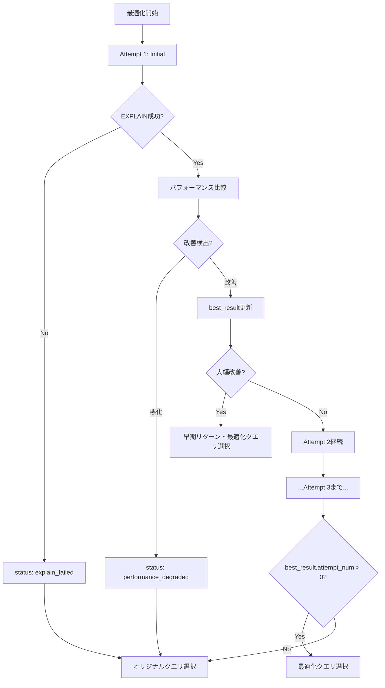

# 🔍 EXPLAIN_ENABLED='Y' でオリジナルクエリが使用される条件の詳細分析

## 📋 質問への回答

**質問:** EXPLAIN_ENABLED = 'Y'で改善は認められない場合のみオリジナルクエリを使用することになっていますか？

**回答:** **はい、その通りです。** しかし、「改善が認められない」だけでなく、他の複数の条件でもオリジナルクエリが使用されます。

## 🎯 オリジナルクエリが使用される条件一覧

### 1. 🏆 best_result.attempt_num = 0 の場合（主要条件）

```python
# query_profiler_analysis.py:16112
if best_result['attempt_num'] > 0:
    # 最適化クエリを選択
    final_query = best_result['query']
else:
    # オリジナルクエリを選択
    print(f"⚠️ Using original query due to errors or evaluation failures in all attempts")
    final_query = original_query
```

**この条件になる原因:**

#### A. 全試行でエラーが発生
- **LLMエラー:** `status: 'llm_error'`
- **EXPLAIN実行失敗:** `status: 'explain_failed'`  
- **パフォーマンス比較エラー:** `status: 'comparison_error'`
- **構文エラー:** `status: 'syntax_error'`

#### B. 全試行でパフォーマンス悪化検出
```python
# パフォーマンス悪化の判定条件
if performance_comparison['performance_degradation_detected']:
    status_reason = "performance_degraded"
    # best_result は更新されない（attempt_num = 0 のまま）
```

### 2. 📊 パフォーマンス比較で悪化検出された場合

#### A. コスト比率による判定
```python
# 基本比較（Stage 1）
basic_ratio = (size_ratio + row_ratio) / 2
if basic_ratio > 1.03:  # 3%以上悪化
    recommendation = 'use_original'
```

#### B. 包括的分析による判定
```python
# 包括的パフォーマンス分析
if comprehensive_cost_ratio > 1.03:  # 3%以上悪化
    'performance_degradation_detected': True,
    'recommendation': 'use_original'
```

#### C. フォールバック分析による判定
```python
# フォールバック評価
if fallback_evaluation['overall_status'] == 'degradation_possible':
    'performance_degradation_detected': True,
    'recommendation': 'use_original'
```

### 3. 🚫 EXPLAIN COST妥当性チェック失敗

```python
def validate_explain_cost_content(explain_cost_text, query_type):
    if len(explain_cost_text) < 200:
        return False, f"{query_type} EXPLAIN COST content too short"
    
    if 'ExplainCommand' in explain_cost_text:
        return False, f"{query_type} EXPLAIN COST contains ExplainCommand"
    
    if '== Optimized Logical Plan ==' not in explain_cost_text:
        return False, f"{query_type} EXPLAIN COST missing expected structure"

# 妥当性チェック失敗時
if not optimized_valid:
    comparison_result['recommendation'] = 'use_original'
```

### 4. ⚠️ エラー時の安全側フォールバック

```python
# 全ステージ失敗時
if all_stages_failed:
    return {
        'performance_degradation_detected': True,
        'recommendation': 'use_original',
        'improvement_level': 'ALL_STAGES_FAILED'
    }

# パフォーマンス比較エラー時
except Exception as e:
    comparison_result['performance_degradation_detected'] = True
    comparison_result['recommendation'] = 'use_original'
```

## 🔍 具体的な判定閾値

### パフォーマンス悪化の判定閾値

```python
# 基本的な閾値設定
DEGRADATION_THRESHOLD = 1.03      # 3%以上悪化で use_original
SIGNIFICANT_IMPROVEMENT = 0.90    # 10%以上改善で significant
SUBSTANTIAL_IMPROVEMENT = 0.80    # 20%以上改善で substantial
MINOR_IMPROVEMENT = 0.97          # 3%以上改善で minor

# 判定ロジック
if cost_ratio > 1.03:
    recommendation = 'use_original'  # 悪化検出
elif cost_ratio < 0.97:
    recommendation = 'use_optimized'  # 改善検出
else:
    # 等価性能の場合はJOIN戦略改善をチェック
    recommendation = 'use_optimized' if join_improved else 'use_original'
```

## 📊 実際の動作フロー



## 🎯 重要なポイント

### 1. **改善が認められない ≠ オリジナルクエリ使用**

改善が認められない場合でも、以下の条件では最適化クエリが使用される可能性があります：

- **等価性能 + JOIN戦略改善:** `recommendation = 'use_optimized'`
- **軽微な改善（3%未満）:** 最適化クエリが選択される場合がある

### 2. **best_result更新の重要性**

```python
# 改善が認められた場合のみ best_result が更新される
if is_better_than_best:
    best_result.update({
        'attempt_num': attempt_num,  # ← 0から変更される
        'query': current_query,      # ← 最適化クエリ
        'cost_ratio': current_cost_ratio,
        'memory_ratio': current_memory_ratio
    })
```

### 3. **安全側の設計思想**

システムは「改善が確実でない場合はオリジナルクエリを使用」という安全側の設計思想を採用しています：

- エラー時 → オリジナルクエリ
- 悪化検出時 → オリジナルクエリ  
- 判定不能時 → オリジナルクエリ

## 📋 まとめ

**EXPLAIN_ENABLED='Y'でオリジナルクエリが使用される条件:**

1. ✅ **パフォーマンス悪化が検出された場合**（3%以上悪化）
2. ✅ **全試行でエラーが発生した場合**（LLM、EXPLAIN、構文エラー等）
3. ✅ **EXPLAIN COST妥当性チェックに失敗した場合**
4. ✅ **パフォーマンス比較処理でエラーが発生した場合**
5. ✅ **全分析ステージが失敗した場合**（安全側フォールバック）

**逆に、以下の場合は最適化クエリが使用されます:**

- 軽微でも改善が検出された場合（3%以上）
- 等価性能でもJOIN戦略が改善された場合
- 大幅改善が検出された場合（早期リターン）

**結論:** 「改善が認められない場合のみ」というより、「**改善が確実に検出されない限り、安全性を重視してオリジナルクエリを使用する**」という設計になっています。

---

**分析者:** AI Assistant  
**分析日:** 2025-01-17  
**対象範囲:** EXPLAIN_ENABLED='Y'時の最終クエリ選択ロジック  
**検証状況:** コード分析完了 ✅